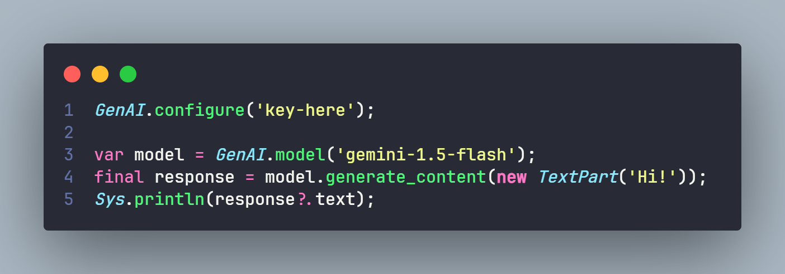

# hxgemini-api

Haxe functions to use the [Gemini IA Integration](https://gemini.google.com/app).



---

> [!WARNING]
> **This is not an official Google Library**, there is still a lot missing from the API. This Library will not be updated frequently!

## Installation
```bash
haxelib git hxgemini-api https://github.com/GuineaPigUuhh/hxgemini-api.git
```